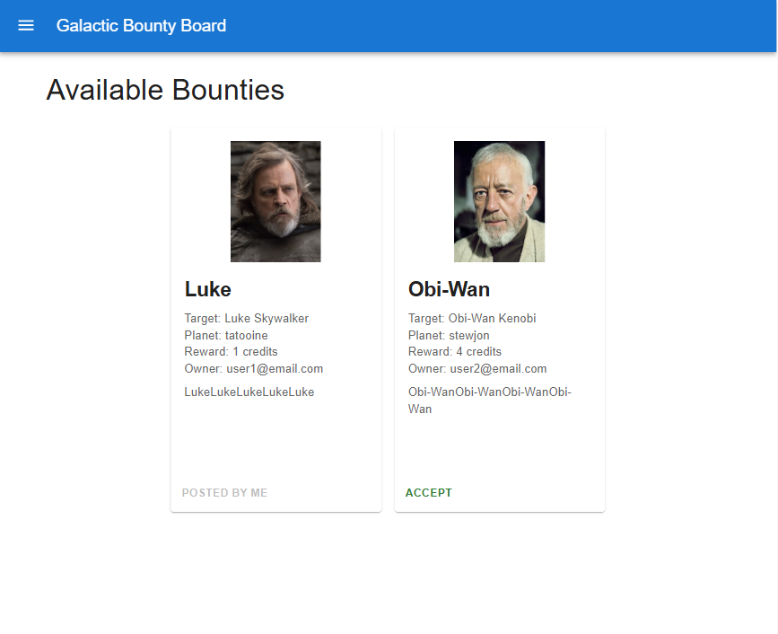
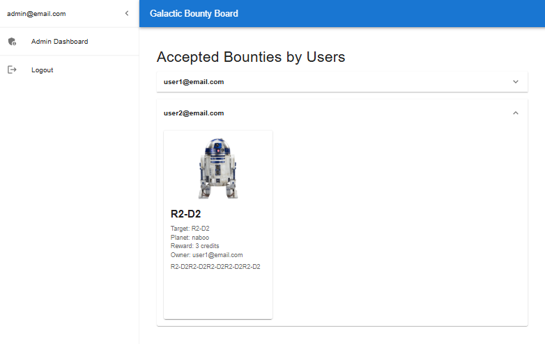
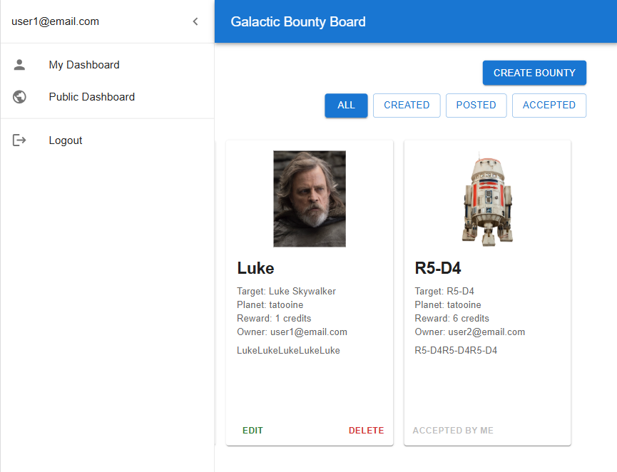
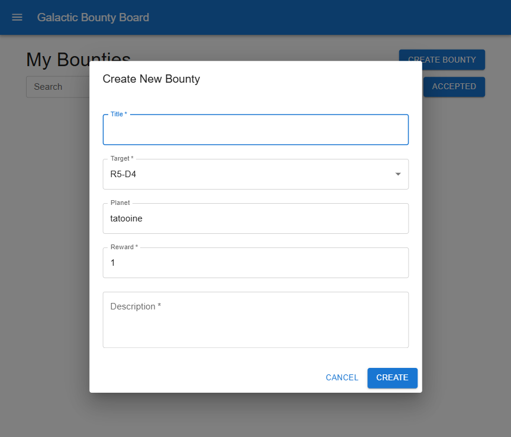
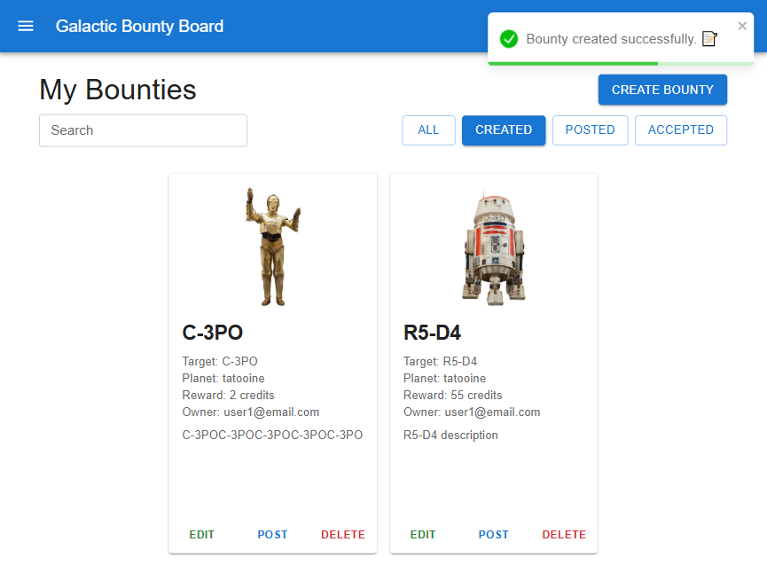
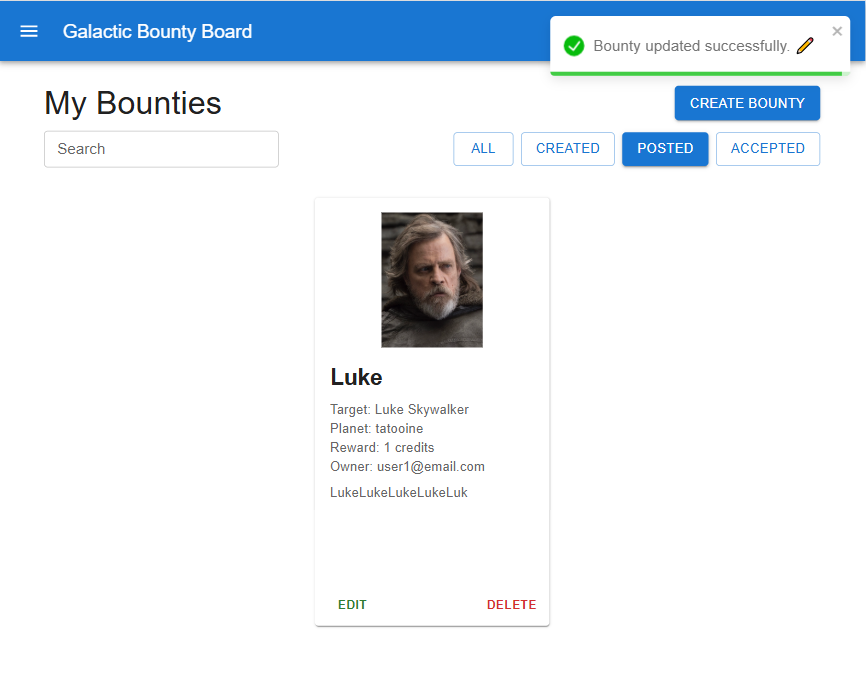

# 🌌 Galactic Bounty Board

Galactic Bounty Board is a full-stack web application where users can create, manage, and accept bounties for characters
from the Star Wars universe.

---












---

This monorepo contains:

- 🧠 **Backend** – GraphQL API with Node.js, PostgreSQL, Prisma
- 🎨 **Frontend** – React + Apollo Client + Zustand + MUI

---

## 🔧 Features

- 🪐 Public bounty board (view available bounties)
- 🔒 Role-based access (Hunter / Admin)
- ✍️ Create, edit, delete, post, and accept bounties
- 🌌 Star Wars character selector (via external API)
- 🔐 Authentication with Refresh/Access tokens via cookies
- ✅ Form validation using Zod
- 🔄 Infinite scroll, filtering, sorting, and client-side pagination
- 📢 Real-time error handling with toast notifications

---

## 📦 Backend – `/server`

### 🛠 Technologies

- **Node.js / TypeScript**
- **GraphQL (Apollo Server v4)**
- **Express.js**
- **Prisma ORM**
- **PostgreSQL**
- **Zod**, **JWT**, **bcrypt**, **dotenv**

### ⚙️ Requirements

- Node.js >= 18
- PostgreSQL instance
- Recommended: pnpm / yarn / npm

### 🚀 Getting Started

#### 1️⃣ Clone & Install

```bash
    git clone https://github.com/IvanRuskevych/galactic-bounty-board.git
    cd galactic-bounty-board/server
    npm install
```

#### 2️⃣ Create environment file

```bash
    cp .env.example .env
    # Fill in DB connection string and JWT secrets
```

#### 3️⃣ Set up the database

```bash
npx prisma migrate dev --name init
npx prisma generate
```

#### 4️⃣ Start the server

```bash
npm run dev
```

Open GraphQL playground at:

```
http://localhost:8000/galactic-bounty
```

#### 5️⃣ (Optional) Open Prisma Studio

```bash
npx prisma studio
```

#### 6️⃣ Generate GraphQL types

```bash
npm run codegen
```

#### ⚙️ Production

```bash
npm run build
npm run start
```

---

## 💻 Frontend – `/client`

### 🛠 Technologies

- **React + TypeScript**
- **Apollo Client**
- **Zustand** (state management)
- **Material UI (MUI v5)**
- **React Router v6**
- **Vite**

### 🚀 Getting Started

#### 1️⃣ Navigate and install dependencies

```bash
    cd ../client
    npm install
```

#### 2️⃣ Setup environment

```bash
    cp .env.example .env
    # Configure VITE_GRAPHQL_API_URL=http://localhost:8000/galactic-bounty
```

#### 3️⃣ Start the app

```bash
  npm run dev
```

App will be available at:

```
    http://localhost:5173
```

---

## 🧪 How to Use

- 🔐 **Register or Login** (role by default - HUNTER)
- 🛠 **Hunter Dashboard** allows creating & managing bounties
- 🌐 **Public Bounty Board** shows all posted bounties
- 📤 **Create, Post, Edit and Accept Bounties** as a Hunter
- 🛰 **Admin Panel** shows all accepted bounties by users

---

## 🧱 Folder Structure

```bash
galactic-bounty-board/
│
├── client/     # React frontend (MUI, Apollo, Zustand)
│   └── ...
├── server/     # Node.js backend (GraphQL, Prisma, PostgreSQL)
│   └── ...
└── README.md   # Project documentation
```

---

## ✅ License

MIT — free to use, modify, and contribute.

---

## 📩 Contact

For questions or suggestions, feel free to open an issue or contact the author.
